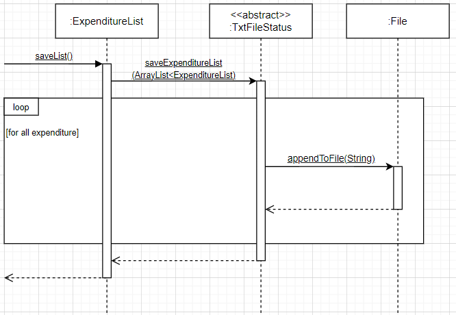
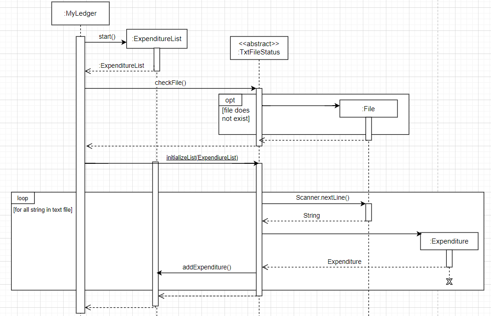
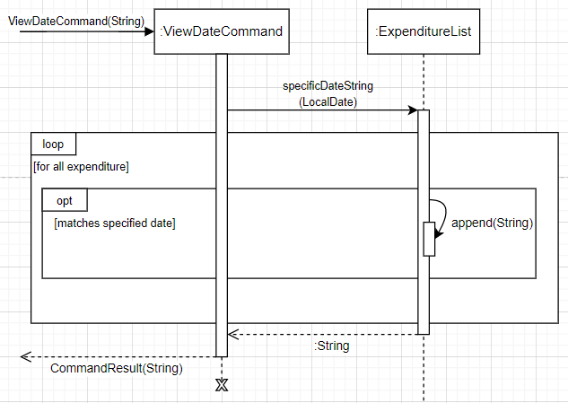

# MyLedger - Developer Guide

<p align="center">
    
</p>

- [1. Preface](#1-preface)
- [2. Acknowledgements](#2-acknowledgements)
- [3. Design & implementation](#3-design--implementation)
  * [3.1. Architecture](#31-architecture)
  * [3.2. Parser Component](#32-parser)
  * [3.3. Expenditures Component](#33-expenditure-categories)
  * [3.4. Storage Component](#34-storage)
  * [3.5. UI Component](#35-ui)
- [4. Command List](#4-command-list)
  - Adding a Todo: [```todo```](#adding-a-todo-todo)
  - Adding a Deadline: [```deadline```](#adding-a-deadline-deadline)
  - Adding an Event: [```event```](#adding-an-event-event)
  - Listing all tasks: All tasks: [```list```](#listing-all-tasks-list) and Tasks on specific date: [```list```](#listing-all-tasks-occurring-on-a-specific-date)
  - Finding tasks: [```find```](#finding-tasks-find)
  - Marking a task: [```mark```](#marking-a-task-mark)
  - Unmarking a task: [```unmark```](#unmarking-a-task-unmark)
  - Deleting a task: [```delete```](#deleting-a-task-delete)
  - Exiting the program: [```bye```](#exiting-the-program-exit)
  - Editing an expenditure: [```edit```](#42-edit-command)
  - Saving the data

## 1. Preface


## 2. Acknowledgements

{list here sources of all reused/adapted ideas, code, documentation, and third-party libraries -- include links to the original source as well}

## 3. Design & implementation

### 3.1. Architecture

{Describe the design and implementation of the product. Use UML diagrams and short code snippets where applicable.}

### Main Components of MyLedger
`Parser:` Processes the inputs made by the user and converts into a sensible form for further processing.

`Commands:` Matches the input command with the respective commands created and executes the command result.

`Expenditure Type:` Expenditure information that allows the users to access their input data from the respective 
command classes.

`Storage:` Stores, reads and updates the user input into their hard disk.

The following section describes the implementation of certain features.

### 3.2. Parser
#### Processing an input
The main parser component `MainInputParser` is called whenever the user inputs a command line that requires action from 
the application. The command word will be read and further processed into further components depending on the type of 
command. 

The following shows the UML diagram used for the parser component implemented in MyLedger.


It must be noted that not all the existing parser commands are included in this sequence diagram for parsing, namely
the mark, unmark and edit commands. This is because they have a similar sequence diagram as the functions parseAdd and 
parseLendBorrow. The only difference is the condition, with the loop happening one, one and four time(s) respectively. 


### 3.3. Expenditure Categories
The **API** of this component is specified in the super abstract class `Expenditure.java` and its sub-classes. Its sub-classes represent the different expenditure categories. When users create a new expenditure record, one of these different expenditure categories are instantiated. The expenditure types and fields are as shown below.

`Expenditure`:
- Fields: `date`, `amount`, `description`

`AcademicExpenditure`: 
- Fields: `date`, `amount`, `description`
`AccommodationExpenditure`:
- Fields: `date`, `amount`, `description`, `isPaid`
`BorrowExpenditure`:
- Fields: `date`, `borrowerName`, `amount`, `deadline`, `description`
`EntertainmentExpenditure`
- Fields: `date`, `amount`, `description`
`FoodExpenditure`: 
- Fields: `date`, `amount`, `description`
`LendExpenditure`:
- Fields: `date`, `borrowerName`, `amount`, `deadline`, `description`
`OtherExpenditure`:
- Fields: `date`, `amount`, `description`
`TransportExpenditure`:
- Fields: `date`, `amount`, `description`
`TuitionExpenditure`:
- Fields: `date`, `amount`, `description`, `isPaid`

`ExpenditureList`:
- Instantiated at the start of the program and stores expenditures of type `Expenditure`.

The following shows the UML diagram used for the Expenditure Categories component implemented in MyLedger.


In the diagram, the aforementioned expenditure categories inherit from the `Expenditure` class. The `ExpenditureList` class is a composition of expenditures of `Expenditure` type. 

`Expenditure` has a multiplicity of `*` to `ExpenditureList` as an empty expenditure list is instantiated at the beginning of the program, and any number of expenditures can be added to the expenditure list. Thus, it is also observed that the `ExpenditureList` class is an *composition* of `Expenditure`.

### 3.4. Storage
The class `TxtFileStatus` and `ExpenditureList` are involved in storing the expenditure list.
After every user input is completed, saveExpenditureList is called, and the text file will be
updated with all the current expenditures in the expenditure array list.



The following sequence diagram shows the details of the process for saveExpenditureList.

Likewise when MyLedger first runs, it instantiates ExpenditureList and stores a reference to it.
MyLedger then checks if the text file exists, else it gets created. Recorded expenditure stored 
as a string in the text file is then added to the array list in ExpenditureList by iterating through
the strings in the text file, instantiating an expenditure using the string received, and adding
the expenditure into the array list.



### 3.5. UI 

## 4. Command List

### 4.2. Edit Command

The ```EditCommand``` edits an existing expenditure in the record.

It cannot change the expenditure type of a record, only its fields

For editing an expenditure, the full command is  ```edit INDEX d/DATE a/AMOUNT s/DESCRIPTION```

For editing a borrow/lend record, the full command is  ```edit INDEX d/DATE n/(LEND/BORROW)_NAME a/AMOUNT b/DEADLINE s/DESCRIPTION```
       
The sequence diagram below shows the interactions of a successful execution of the EditCommand

<p align="center">
    
    <br />
    <i>Figure 3: Sequence Diagram for edit Command</i>
</p>

### 4.3. View Command

The view command filters and lists the expenditures of a specified date or type.
At the end of the list, the total amount of the filtered expenditures are tabulated.
For viewing expenditures of specific date, the command is ```viewdate DATE```.
For viewing expenditures of specific type, the command is ```viewtype EXPENDITURE_TYPE```.

The sequence diagram below shows the details of the process for viewdate.



The process for viewtype is similar as viewdate with an additional step within ViewTypeExpenditureCommand
that converts the input string into a string recognisable for comparison in the opt block. 

## Product scope
### Target user profile

- University students studying locally or on exchange 
- has a need to monitor their budget and expenses
- prefer desktop CLI over other available types of expense tracking applications 
- prefers typing to mouse interactions

### Value proposition

Manage finances more efficiently than a typical mouse/GUI driven app

## User Stories

| Version | As a ...        | I want to ...                        | So that I can ...                                    |
|---------|-----------------|--------------------------------------|------------------------------------------------------|
| v1.0    | first time user | have access to a help page           | be familarized with the features available           |
| v1.0    | user            | add a expenditure recorded in a day  |                                                      |
| v1.0    | user            | delete an expenditure record         | get rid of expenditure that I no longer plan to use  |
| v1.0    | user            | edit an expenditure record           | correct previous expenditure records                 |
| v1.0    | user            | view all current expenses            | have a good overview of my spending to date          |
| v1.0    | user            | add a record for borrowing money     | keep track of how much money I borrowed to someone   |
| v1.0    | user            | add a record for lending money       | keep track of how much money I lent to someone       |
| v2.0    | user            | sort expenditures based on date      | better manage my expenditures                        |
| v2.0    | user            | sort expenditures based on amount    | better manage my expenditures                        |
| v2.0    | user            | add income earned                    | keep track of my current budget                      |
| v2.0    | user            | find expenditures using description  | better manage my spending                            |
| v2.0    | user            | duplicate a current expenditure      | update repeated purchases easily                     |
| v2.0    | user            | indicate a specific budget to follow | track my spending and make sure I stay within budget |
| v2.0    | user            | be able to view expenses by day      | see which day and why I am overspending              |
| v2.0    | user            | view my total expenses by categories | see which categories I am overspending on            |

## Non-Functional Requirements

{Give non-functional requirements}

## Glossary

* *glossary item* - Definition

## Instructions for manual testing

{Give instructions on how to do a manual product testing e.g., how to load sample data to be used for testing}
