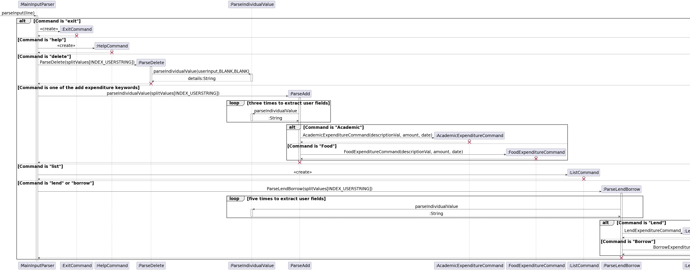

# Developer Guide

## Acknowledgements

{list here sources of all reused/adapted ideas, code, documentation, and third-party libraries -- include links to the original source as well}

## Design & implementation

{Describe the design and implementation of the product. Use UML diagrams and short code snippets where applicable.}

### Main Components of MyLedger
`Parser:` Processes the inputs made by the user and converts into a sensible form for further processing.

`Commands:` Matches the input command with the respective commands created and executes the command result.

`Expenditure Type:` Expenditure information that allows the users to access their input data from the respective 
command classes.

`Storage:` Stores, reads and updates the user input into their hard disk.

The following section describes the implementation of certain features.

### Parser
#### Processing an input
The main parser component `MainInputParser` is called whenever the user inputs a command line that requires action from 
the application. The command word will be read and further processed into further components depending on the type of 
command. 

The following shows the UML diagram used for the parser component implemented in MyLedger.

It must be noted that not all the existing parser commands are included in this sequence diagram for parsing, namely
the mark, unmark and edit commands. This is because they have a similar sequence diagram as the functions parseAdd and 
parseLendBorrow. The only difference is the condition, with the loop happening one, one and four time(s) respectively. 

### Commands

### Expenditure Type

### Storage

## Product scope
### Target user profile

- University students studying locally or on exchange 
- has a need to monitor their budget and expenses
- prefer desktop CLI over other available types of expense tracking applications 
- prefers typing to mouse interactions

### Value proposition

Manage finances more efficiently than a typical mouse/GUI driven app

## User Stories

| Version | As a ...        | I want to ...                        | So that I can ...                                    |
|---------|-----------------|--------------------------------------|------------------------------------------------------|
| v1.0    | first time user | have access to a help page           | be familarized with the features available           |
| v1.0    | user            | add a expenditure recorded in a day  |                                                      |
| v1.0    | user            | delete an expenditure record         | get rid of expenditure that I no longer plan to use  |
| v1.0    | user            | edit an expenditure record           | correct previous expenditure records                 |
| v1.0    | user            | view all current expenses            | have a good overview of my spending to date          |
| v1.0    | user            | add a record for borrowing money     | keep track of how much money I borrowed to someone   |
| v1.0    | user            | add a record for lending money       | keep track of how much money I lent to someone       |
| v2.0    | user            | sort expenditures based on date      | better manage my expenditures                        |
| v2.0    | user            | sort expenditures based on amount    | better manage my expenditures                        |
| v2.0    | user            | add income earned                    | keep track of my current budget                      |
| v2.0    | user            | find expenditures using description  | better manage my spending                            |
| v2.0    | user            | duplicate a current expenditure      | update repeated purchases easily                     |
| v2.0    | user            | indicate a specific budget to follow | track my spending and make sure I stay within budget |
| v2.0    | user            | be able to view expenses by day      | see which day and why I am overspending              |
| v2.0    | user            | view my total expenses by categories | see which categories I am overspending on            |

## Non-Functional Requirements

{Give non-functional requirements}

## Glossary

* *glossary item* - Definition

## Instructions for manual testing

{Give instructions on how to do a manual product testing e.g., how to load sample data to be used for testing}
